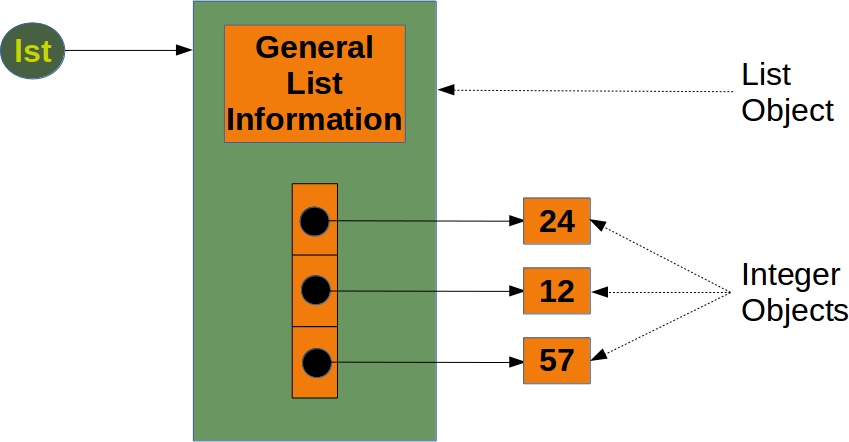

# pandas-cheatsheet

## install
```
pip3 install jupyter
pip3 install ipython
```

## run 
```
jupyter notebook
```

# Introduction  
* It offers data structures and operations for manipulating numerical tables and time series
* it is on top of `numpy`

## `numpy`
* It is a more basic library that provides the building blocks of array based data manipulation
* It is more efficient (faster and smaller) than python list
  * We can consider python list as `dynamic arrays`
  * In `CPython`, lists are arrays of pointers
```c
typedef struct {
    PyObject_VAR_HEAD
    /* Vector of pointers to list elements.  list[0] is ob_item[0], etc. */
    PyObject **ob_item;

    /* ob_item contains space for 'allocated' elements.  The number
     * currently in use is ob_size.
     * Invariants:
     *     0 <= ob_size <= allocated
     *     len(list) == ob_size
     *     ob_item == NULL implies ob_size == allocated == 0
     * list.sort() temporarily sets allocated to -1 to detect mutations.
     *
     * Items must normally not be NULL, except during construction when
     * the list is not yet visible outside the function that builds it.
     */
    Py_ssize_t allocated;
} PyListObject;
```
  * `Jython` uses an `ArrayList<PyObject>`
* It provides other functionalities (e.g., FFT, convolution, reshape, ...)

### internal implementation
* python list

* numpy array


## Data Structure  
DataFrame

## Data operations  
filter (where in SQL), select(select in SQL), mutate, arrange(order by in SQL), summarise, group_by  

## Data source  
csv, excel, database, ...  

# Reference
https://medium.com/datainpoint/%E5%BE%9E-pandas-%E9%96%8B%E5%A7%8B-python-%E8%88%87%E8%B3%87%E6%96%99%E7%A7%91%E5%AD%B8%E4%B9%8B%E6%97%85-8dee36796d4a  
https://stackoverflow.com/questions/993984/what-are-the-advantages-of-numpy-over-regular-python-lists  
https://stackoverflow.com/questions/3917574/how-is-pythons-list-implemented  
